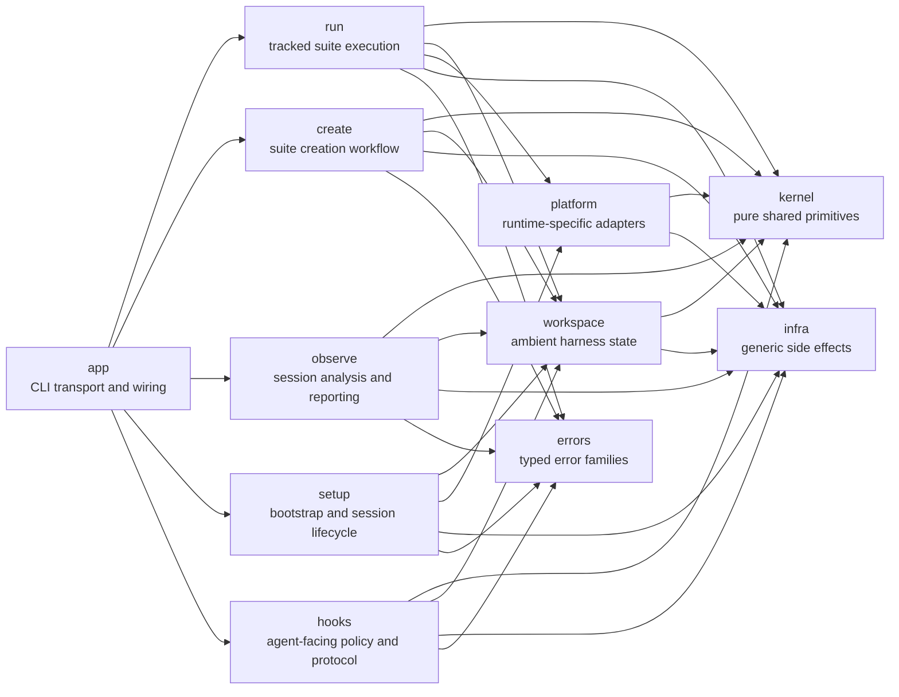
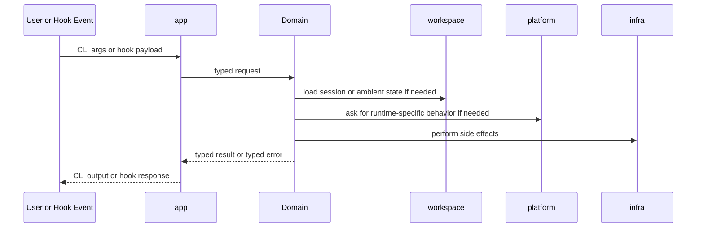
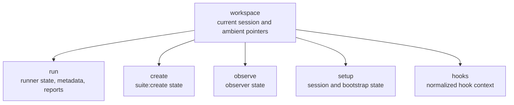

# Harness architecture

This file is the short ownership map for the current layout.

Use [README.md](README.md) for day-to-day usage. Use this file when you need to answer a different question: "where should this code live?"

## High-level shape

## What each root owns

| Path             | Owns                                                                               |
| ---------------- | ---------------------------------------------------------------------------------- |
| `src/app/`       | Clap CLI, top-level command grouping, transport mapping, domain wiring             |
| `src/run/`       | tracked runs, run workflow, prepared artifacts, reporting, run diagnostics, repair |
| `src/create/`    | `suite:create` workflow, approval state, create validation, create session state   |
| `src/observe/`   | log/session scanning, doctor diagnostics, classifiers, dump/scan flows, output     |
| `src/setup/`     | environment bootstrap, wrapper/session lifecycle, cluster setup entrypoints        |
| `src/hooks/`     | hook payload handling, guard policy, protocol normalization, hook effects          |
| `src/kernel/`    | pure shared concepts such as command intent, topology, skill ids, gates            |
| `src/workspace/` | XDG paths, current session pointers, compact handoff, ambient harness files        |
| `src/infra/`     | generic execution, persistence, environment, HTTP, process, and block abstractions |
| `src/errors/`    | typed error families plus transport-safe rendering                                 |

## Internal support roots

These are real roots in the repo, but they are not part of the main public domain map:

- `src/platform/` is crate-internal adapter code for runtime-specific behavior.
- `src/manifests/` is crate-internal manifest plumbing.
- `src/suite_defaults/` is crate-internal suite scaffolding and defaults.
- `src/codec/` is test-only support code and is not part of the public library surface.

## Public crate surface

The current `src/lib.rs` surface is:

- public: `app`, `create`, `errors`, `hooks`, `infra`, `kernel`, `observe`, `run`, `setup`, `workspace`
- crate-internal: `platform`, `manifests`, `suite_defaults`
- test-only: `codec`

That means `platform` is intentionally not a stable library API even though it is a first-class internal root.

## Runtime flow

## State boundaries

## Rules

- `app` is transport only. It wires domains together, but domains must not depend on `app`.
- `kernel` is pure. It must not depend on product domains, `platform`, or `infra`.
- `workspace` is the only owner of ambient harness state.
- `platform` is adapter code, not a public crate surface.
- `infra` stays generic and must not depend on product domains.
- `run`, `create`, `observe`, `setup`, and `hooks` own their own workflows and persistence-facing models.
- Shared pure concepts belong in `kernel`. Shared ambient state belongs in `workspace`.

If a module does not fit one of these buckets, it is probably in the wrong place.
