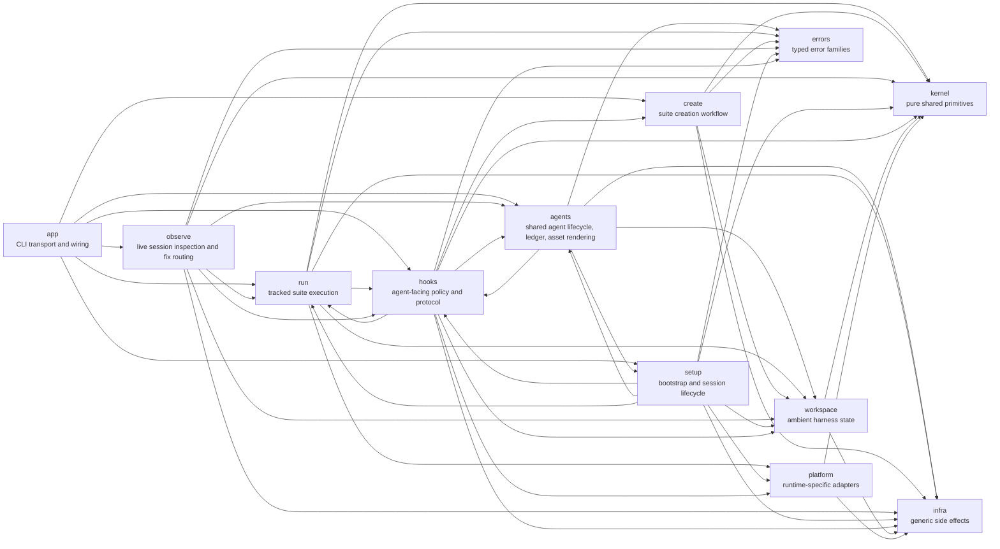
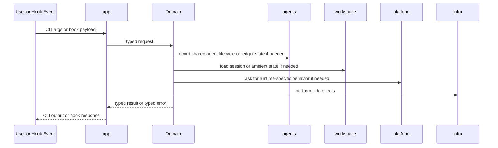
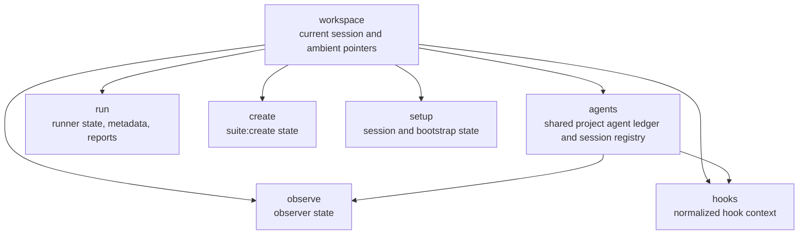

# Harness architecture

This file is the short ownership map for the current layout.

Use [README.md](README.md) for day-to-day usage. Use this file when you need to answer a different question: "where should this code live?"

## High-level shape

## What each root owns

| Path             | Owns                                                                               |
| ---------------- | ---------------------------------------------------------------------------------- |
| `src/agents/`    | shared agent lifecycle commands, canonical agent ledger/session storage, project-scoped agent state, checked-in asset rendering from `agents/` |
| `src/app/`       | Clap CLI, top-level command grouping, transport mapping, domain wiring             |
| `src/run/`       | tracked runs, run workflow, prepared artifacts, reporting, run diagnostics, repair, provider-aware run checks |
| `src/create/`    | `suite:create` workflow, approval state, create validation, create session state   |
| `src/observe/`   | live session inspection, doctor diagnostics, classifiers, dump/scan/watch flows, and fix routing for improving skills and suites |
| `src/setup/`     | environment bootstrap, capabilities/readiness evaluation, wrapper/session lifecycle, provider-aware cluster setup entrypoints, remote kubeconfig materialization, setup install-state tracking |
| `src/hooks/`     | hook payload handling, guard policy, protocol normalization, hook effects          |
| `src/kernel/`    | pure shared concepts such as command intent, topology, skill ids, gates            |
| `src/workspace/` | XDG paths, current session pointers, compact handoff, ambient harness files        |
| `src/infra/`     | generic execution, persistence, environment, HTTP, process, and block abstractions |
| `src/errors/`    | typed error families plus transport-safe rendering                                 |

## Internal support roots

These are real roots in the repo, but they are not part of the main public domain map:

- `src/platform/` is crate-internal adapter code for runtime-specific behavior.
- `src/manifests/` is crate-internal manifest plumbing.
- `src/suite_defaults/` is crate-internal suite scaffolding and defaults.
- `src/codec/` is test-only support code and is not part of the public library surface.

These repo roots matter too even though they are not Rust module roots:

- `agents/` is the canonical authoring source for shared skills and plugins.
- `.claude/`, `.agents/`, `.gemini/`, `plugins/`, and `.github/hooks/` are generated host outputs.

## Public crate surface

The current `src/lib.rs` surface is:

- public: `agents`, `app`, `create`, `errors`, `hooks`, `infra`, `kernel`, `observe`, `run`, `setup`, `workspace`
- crate-internal: `platform`, `manifests`, `suite_defaults`
- test-only: `codec`

That means `platform` is intentionally not a stable library API even though it is a first-class internal root.

## Source-of-truth model

Harness now has three different layers that matter:

1. `agents/` in the repo is the authoring source for shared skills and plugins.
2. Generated host files such as `.claude/settings.json` or `plugins/suite/plugin.json` are install targets, not source.
3. Runtime state lives under the harness project ledger, not in host-owned transcript directories.

For cross-agent work, the runtime source of truth is the project-scoped harness state under `~harness/projects/project-<digest>/agents/`, including:

- `ledger/events.jsonl` for normalized cross-agent events
- `sessions/<agent>/<session-id>/raw.jsonl` for raw per-session payloads
- `observe/<observe-id>/...` for shared observer state

Host-native stores such as `~/.claude/projects` are compatibility fallbacks for older sessions. They are not the main runtime contract anymore.

## Runtime flow

## State boundaries

`workspace` still owns path discovery, current-run pointers, and compact handoff files. `agents` owns shared cross-agent session state and the project ledger. That split matters: path resolution belongs in `workspace`, while durable multi-agent state belongs in `agents`.

## Cross-agent flow

The main cross-agent path now looks like this:

1. Author a shared skill or plugin under `agents/`.
2. Render checked-in host outputs with `harness setup agents generate`.
3. Bootstrap one host with `harness setup bootstrap --agent <claude|codex|gemini|copilot>`.
4. Let lifecycle hooks call back into `harness agents session-start`, `session-stop`, or `prompt-submit`.
5. Use `observe` to inspect live sessions, route fixes, and improve skills or suites while the shared state is still active.
6. Read the resulting shared agent state back through `observe`, hooks, or other harness commands.

That keeps host wrappers thin. They translate local hook payloads, but harness owns the real workflow state.

## Rules

- `app` is transport only. It wires domains together, but domains must not depend on `app`. The one exception is `app::command_context::Execute`, which all command handlers implement as the transport trait.
- `agents` owns cross-agent lifecycle, shared session state, and checked-in asset rendering. Do not hide those concerns in `setup`, `hooks`, or host-specific generated files.
- `kernel` is pure. It must not depend on product domains, `platform`, or `infra`. Known violation: `kernel::topology::parsing` imports `HARNESS_PREFIX` from `workspace`.
- `workspace` owns path resolution and ambient harness files, not cross-agent workflow state.
- `platform` is adapter code, not a public crate surface.
- `infra` stays generic and must not depend on product domains.
- `setup` bootstraps wrappers and readiness. It should not become the source of truth for agent ledgers or rendered assets. It reads `run`, `agents`, and `hooks` types for cluster provisioning and session coordination.
- `hooks` normalizes and enforces policy. It reads `run` workflow state, `create` workflow state, and `agents` services to make guard decisions and record events. It should feed shared state through `agents`, not own separate durable copies.
- `observe` is the live inspection and improvement loop for skills and suites. It reads the shared harness ledger through `agents` storage and checks run pointers from `run`. It falls back to legacy host transcript storage for compatibility.
- Shared pure concepts belong in `kernel`. Shared path/state discovery belongs in `workspace`. Shared durable multi-agent state belongs in `agents`.

If a module does not fit one of these buckets, it is probably in the wrong place.
