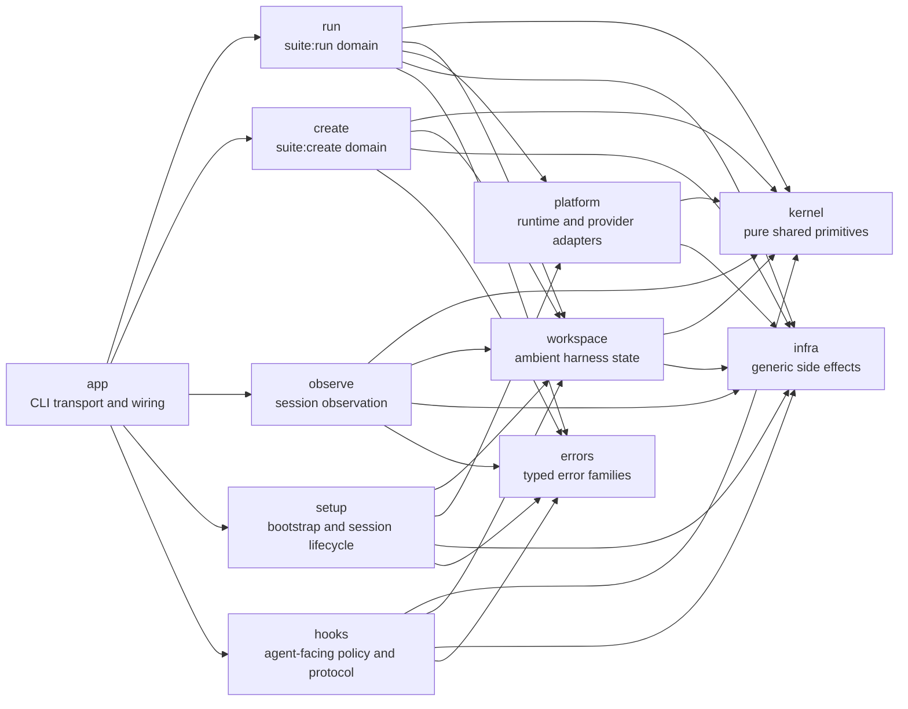
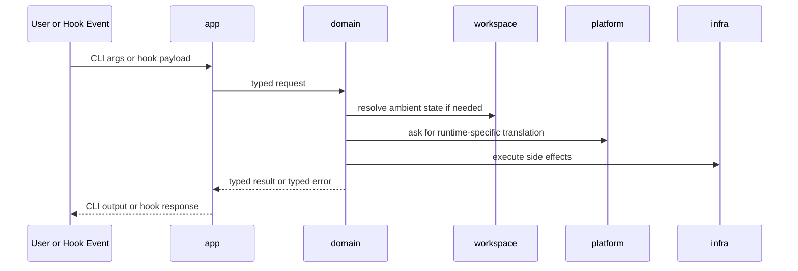
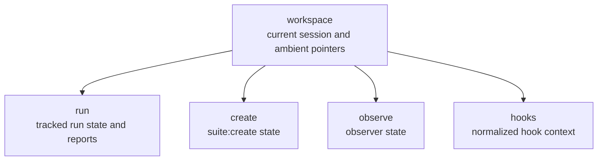

# Harness Architecture

Harness is organized by domain, with a small pure kernel and an explicit workspace layer for ambient state.

## Shape

## Ownership

| Area | Owns |
| --- | --- |
| `src/app/` | Clap entrypoints, top-level command grouping, wiring into domain APIs |
| `src/run/` | tracked run lifecycle, specs, prepared artifacts, reporting, run workflow |
| `src/create/` | `suite:create` payloads, approval workflow, validation, create session state |
| `src/observe/` | session scanning, watch/dump flows, classifier output, observer state |
| `src/setup/` | bootstrap, wrapper/session lifecycle, cluster setup entrypoints |
| `src/hooks/` | hook protocol, normalization, policy input hydration, guards, effects |
| `src/kernel/` | pure shared concepts such as command intent, tool facts, run surface, topology, gates, skill ids |
| `src/workspace/` | XDG paths, session context, current-run pointers, compact handoff, harness-owned ambient files |
| `src/platform/` | provider-specific runtime helpers such as `kubectl_validate`, runtime access, ephemeral `MetalLB` |
| `src/infra/` | generic execution, HTTP, process, persistence, environment, and block abstractions |
| `src/errors/` | typed error families and transport-safe rendering |

## Runtime Flow

## Rules

- `app` is transport only. It may wire domains together, but domains must not depend on `app`.
- `kernel` is pure. It must not depend on product domains, `platform`, or `infra`.
- `workspace` is the only owner of ambient harness state. Domains should not rebuild XDG/session/current-run logic on their own.
- `platform` is adapter logic only. Generic topology lives in `kernel`, not `platform`.
- `infra` stays generic. It must not depend on product domains.
- `run`, `create`, `observe`, `setup`, and `hooks` own their own workflows and persistence-facing models.
- The public crate surface is domain-oriented. `platform` is intentionally crate-internal.
- Shared abstractions must have a real owner. If a concept is cross-domain and pure, it belongs in `kernel`; if it is ambient state, it belongs in `workspace`.

## Public Surface

The intended public shape is app-first and domain-first:

- public: `app`, `run`, `create`, `observe`, `setup`, `hooks`, `kernel`, `workspace`, `infra`, `errors`
- internal: `platform`, manifest plumbing, suite defaults, test-only codec helpers

## State Boundaries

Use this document as the short contract. If a module does not clearly fit one of these ownership buckets, it is probably in the wrong place.
