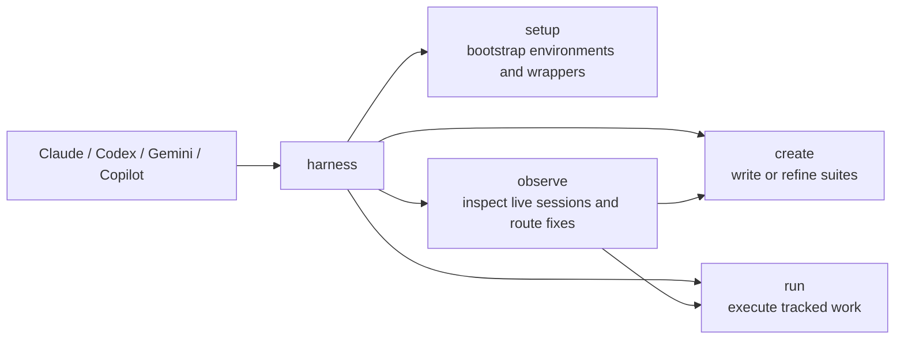

# harness

`harness` is the workflow engine and source of truth for tracked test work, shared agent state, and repo-aware automation in Kubernetes and Kuma projects.

It helps you:

- start a disposable test environment
- create a test suite
- run that suite step by step
- keep a durable record of what happened
- let Claude, Codex, Gemini, and Copilot work against the same harness-managed state

If you want the internal structure, see [ARCHITECTURE.md](ARCHITECTURE.md). This README is about day-to-day use.

## What the main commands do

Most people only need these command groups:

- `harness setup` prepares local environments and session state
- `harness create` helps you build a new suite
- `harness run` executes a suite
- `harness observe` is the live feedback loop for improving skills, hooks, and test suites while sessions are still in flight
- `harness agents` is the shared lifecycle and state API used by generated skills, plugins, and hooks

You will also see `hook`, `session-start`, `session-stop`, and `pre-compact`. Those are mostly for editor and hook integration. You usually do not run them by hand.

Author agent-facing assets once under `agents/`, then render them into:

- `.claude/`
- `.agents/`
- `.gemini/`
- `plugins/`
- `.github/hooks/`

Treat those rendered directories as generated output.

## The basic idea

- A **suite** is the test definition. It usually lives in a `suite.md` file.
- A **create session** is the guided flow for writing a new suite.
- A **run** is one execution of a suite against a real cluster.
- **observe** helps inspect live sessions, route fixes, and improve skills or suites without leaving the tracked workflow.

The core loop looks like this:



In order:

1. `setup`
2. `create`
3. `run`
4. `observe`

## Install

If you are building from source:

```bash
mise run install
```

That builds a release binary and installs `harness` to `~/.local/bin`.

Requirements:

- Rust `1.94+`

## Check what is usable

Before `create` or `run`, you can ask harness what it supports and what is actually ready right now:

```bash
harness setup capabilities
```

Important difference:

- `available` means harness supports that feature or platform in general
- `readiness` means your current machine, project, and repo are ready for it now
- `providers` tells you which cluster backends exist (`k3d`, `remote`, `compose`)
- `readiness.providers` tells you which of those backends are usable right now

For Docker-backed work, `harness setup capabilities` is the source of truth. Harness defaults to the Bollard-backed container runtime when `HARNESS_CONTAINER_RUNTIME` is unset. Set `HARNESS_CONTAINER_RUNTIME=docker-cli` only if you explicitly want the CLI-backed fallback. With the default backend, Docker Engine reachability matters; the Docker CLI itself does not.

For Kubernetes-backed work, `harness setup capabilities` is also the source of truth. Harness defaults to the native `kube` runtime when `HARNESS_KUBERNETES_RUNTIME` is unset. Set `HARNESS_KUBERNETES_RUNTIME=kubectl-cli` only if you explicitly want the CLI-backed fallback. With the default backend, missing `kubectl` alone does not block native `harness run validate`, `harness run apply`, `harness run capture`, or Kubernetes readiness checks. `kubectl` is still required for tracked `harness run record -- kubectl ...` commands and any flow that explicitly selects the CLI backend.

Use `--project-dir` or `--repo-root` only when you are debugging broken cwd or project state. Normal usage should stay zero-arg.

## A normal run

This is the usual flow when you already have a suite.

```bash
REPO=/path/to/repo
SUITE=$REPO/suites/my-feature
RUN_ID=my-feature-001

# 1. Start a disposable cluster
harness setup kuma cluster single-up dev --repo-root "$REPO"

# 2. Start the tracked run and prepare it
harness run start --suite "$SUITE" --run-id "$RUN_ID" --profile single-zone --repo-root "$REPO"

# 3. Apply or record work through harness
harness run apply --manifest manifests/app.yaml
harness run record -- kubectl get pods -A

# 4. Finish the run
harness run finish
```

Harness stores the run state on disk, so you can inspect it later and the command history stays attached to the run instead of disappearing into shell history.

If you need to pick an unfinished run back up, use `harness run resume --run-id <id> --run-root <path>` or just `harness run resume` when the current run pointer is already active.

For an existing remote Kubernetes cluster, use the same flow but attach with `--provider remote` and explicit kubeconfig mappings:

```bash
harness setup kuma cluster \
  --provider remote \
  --remote name=dev,kubeconfig=/path/to/dev.yaml \
  --push-prefix ghcr.io/acme/kuma \
  --push-tag branch-dev \
  single-up dev
```

Harness will materialize tracked kubeconfigs, push branch images through the Kuma repo contract, and deploy or upgrade Kuma without creating or deleting the cluster itself.

For local k3d bootstrap, prefer `harness setup kuma cluster --no-build` and `--no-load` over raw build/load env vars. Harness translates those flags to the current Kuma-side contract internally. Long-running cluster setup commands also emit info-level progress lines such as `started`, `still running`, `command progress`, and `completed` so you can see that bootstrap is moving.

## Creating a suite

Use `create` when you are writing a new suite or changing one.

```bash
REPO=/path/to/repo
SUITE_DIR=$REPO/suites/my-feature

harness create begin \
  --repo-root "$REPO" \
  --feature my-feature \
  --mode interactive \
  --suite-dir "$SUITE_DIR" \
  --suite-name my-feature

harness create approval-begin \
  --mode interactive \
  --suite-dir "$SUITE_DIR"

harness create show --kind session
harness create validate
```

Useful create commands:

- `harness create begin` starts the create workspace
- `harness create approval-begin` starts the approval state used by hooks
- `harness create show` prints the current create state
- `harness create save` saves progress
- `harness create validate` checks the suite content
- `harness create reset` clears the current create state

## Cross-agent sessions

Bootstrap editor integration with one of the supported agent names:

- `claude`
- `codex`
- `gemini`
- `copilot`

Generated hooks and plugins call back into `harness agents ...`, `harness create ...`, `harness run ...`, and `harness observe ...`. They should not keep their own durable workflow state.

```bash
harness setup bootstrap --agent claude
```

`observe` can follow the same investigation across agents:

```bash
harness observe --agent claude --observe-id project-default doctor
harness observe --agent codex --observe-id project-default scan <session-id> --summary
```

## Rules

- Use harness commands for cluster work. Do not go around it with direct `kubectl`, `helm`, `docker`, `k3d`, or similar calls.
- Treat the run directory as the source of truth for a run.
- Treat the suite directory as the source of truth for a suite.
- Use `observe` when something feels off instead of guessing from memory.

## Where harness stores things

Harness uses XDG-style state directories.

- suites: `$XDG_DATA_HOME/harness/suites/`
- runs: `$XDG_DATA_HOME/harness/runs/<run-id>/`
- session context: `$XDG_DATA_HOME/harness/contexts/<session-hash>/`
- shared agent ledger: `~harness/projects/project-<digest>/agents/ledger/events.jsonl`
- shared raw agent sessions: `~harness/projects/project-<digest>/agents/sessions/<agent>/<session-id>/raw.jsonl`
- shared observe state: `~harness/projects/project-<digest>/agents/observe/<observe-id>/`

A run directory usually contains:

- `artifacts/` for collected output
- `commands/` for recorded command logs
- `manifests/` for prepared manifests
- `suite-run-state.json` for runner state
- `run-report.md` for the human-readable report

The create approval state lives in harness-managed project state and hook-enforced workflow files. Do not edit those files by hand.

## When you get stuck

Start here:

- `harness observe doctor` to check wrapper wiring, lifecycle commands, current-run pointers, compact handoff state, and the active Kuma repo contract
- `harness setup agents generate --check` to verify generated agent assets are in sync with `agents/`
- `harness setup capabilities` to see which profiles and features are ready on this machine right now
- `harness observe scan` to classify problems in session logs
- `harness run doctor` to inspect one tracked run and its pointer state
- `harness run repair` to apply safe repairs to broken run metadata, status, or current-run pointers
- `run-report.md` in the run directory for the high-level result
- `commands/` in the run directory for the exact command history

If `harness run repair` still leaves blocking findings, start a fresh tracked run with `harness run start` instead of editing state files by hand.

## For contributors

The main checks are:

```bash
mise run check
mise run test
```

If you need the full internal map, use [ARCHITECTURE.md](ARCHITECTURE.md).
