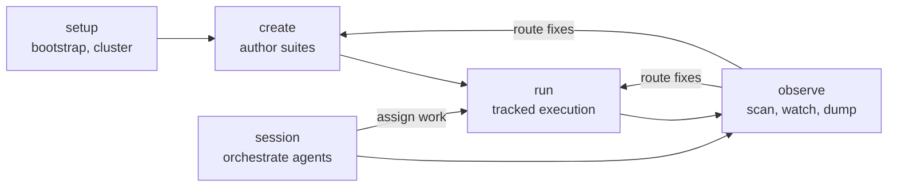

# harness

Harness is a local control plane for running multiple AI coding agents as a coordinated swarm. It works with Claude, Codex, Gemini, Copilot, Vibe, and OpenCode, and manages session state, roles, task assignment, review, and live inspection across them.

It also carries tracked Kubernetes/Kuma suite workflows for disposable test environments.

For the internal module map, see [ARCHITECTURE.md](ARCHITECTURE.md).

## Install

```bash
mise run install
```

Builds and installs the Harness CLI, the `harness-systemd` lifecycle controller, ACP adapters, and `aff` into `~/.local/bin`. Requires Rust 1.94+.

The installer reconciles stale Harness binaries on your `PATH`, including old `~/.cargo/bin/harness` shadows. If it cannot rewrite a conflicting path safely, it fails and tells you which path to clean up.

## Quick start

```bash
# 1. bootstrap agent wiring and runtime hook configs
mise run setup:bootstrap

# 2. point harness at a cluster
harness setup kuma cluster single-up dev --repo-root "$PWD"

# 3. run a suite against it
harness run start --suite ./suites/my-feature --run-id my-feature-001 --profile single-zone
harness run apply --manifest manifests/app.yaml
harness run record -- kubectl get pods -A
harness run finish
```

## Concepts

- **Suite** — an authored, version-tracked set of steps and checks for a feature or scenario.
- **Run** — one tracked execution of a suite against a real cluster. State persists to disk, so you can resume interrupted runs.
- **Session** — a shared workspace where several agents work together with assigned roles.
- **Observe** — live inspection of agent sessions: scan logs, classify issues, watch events, dump raw output.

## Commands at a glance

| Command group | What it does |
| --- | --- |
| `harness setup` | Bootstrap agent wiring, create or attach to a cluster, report capabilities. |
| `harness create` | Guided authoring of new suites. |
| `harness run` | Tracked execution: `start`, `apply`, `record`, `validate`, `doctor`, `resume`, `finish`. |
| `harness observe` | Inspect live sessions: `scan`, `watch`, `dump`, `doctor`. |
| `harness session` | Orchestrate multiple agents with roles, tasks, and cross-agent observation. |
| `harness-hook` | Cross-agent lifecycle entrypoints, called by generated hooks. |

Run any command with `--help` for the full flag reference.

## Typical workflow



1. `harness setup` — bootstrap agent wiring and cluster access.
2. `harness create` — author a suite, or skip if you have one.
3. `harness run` — execute the suite against a real cluster.
4. `harness observe` — inspect sessions, classify issues, route fixes.
5. `harness session` — coordinate several agents with roles and tasks.

## Multi-agent sessions

Agents join a session with a role — leader, worker, observer, reviewer, or improver. Each role has a permission set that controls which commands it can run. One observer scans every agent's log through the same classifier pipeline as `harness observe`.

```bash
harness session start --context "fix mesh retry feature" --title "mesh retry"
harness session join <session-id> --role leader  --runtime claude
harness session join <session-id> --role worker  --runtime codex
harness session join <session-id> --role observer --runtime gemini
harness session observe <session-id> --poll-interval 3 --json --actor <leader-agent-id>
harness session task list <session-id> --json
harness session end <session-id> --actor <leader-agent-id>
```

To narrow bootstrap to a subset of runtimes, or to inspect one agent in particular:

```bash
mise run setup:bootstrap -- --agents codex
harness observe --agent codex scan <session-id>
```

## Running a suite

### Local k3d cluster

```bash
REPO=/path/to/repo
SUITE=$REPO/suites/my-feature
RUN_ID=my-feature-001

harness setup kuma cluster single-up dev --repo-root "$REPO"
harness run start --suite "$SUITE" --run-id "$RUN_ID" --profile single-zone --repo-root "$REPO"
harness run apply --manifest manifests/app.yaml
harness run record -- kubectl get pods -A
harness run finish
```

For local k3d, prefer `--no-build` and `--no-load` flags over raw build/load env vars. Harness translates them internally.

### Remote cluster

```bash
harness setup kuma cluster \
  --provider remote \
  --remote name=dev,kubeconfig=/path/to/dev.yaml \
  --push-prefix ghcr.io/acme/kuma \
  --push-tag branch-dev \
  single-up dev
```

Harness materializes tracked kubeconfigs, pushes branch images, and deploys Kuma. It never creates or deletes the remote cluster itself.

### Resuming a run

```bash
harness run resume --run-id <id> --run-root <path>
```

Run state persists to disk, so you can pick up an interrupted run later. The command history stays attached.

## Hook guards

Harness intercepts agent tool use through hooks that enforce tracked workflows.

- **`tool-guard`** blocks direct use of cluster binaries (`kubectl`, `docker`, `k3d`, `helm`, `kumactl`, and others), `gh` during active runs, inline Python, legacy wrapper scripts, and out-of-surface writes. All cluster access goes through harness commands. The one escape hatch is `harness run record -- kubectl ...`, which routes through the tracked runner.
- **`tool-result`** validates tool outcomes and runner-state transitions after each tool completes.
- **`tool-failure`** enriches failed tool calls with current run-verdict context.

The suite-lifecycle hooks (`guard-stop`, `context-agent`, `validate-agent`, `tool-failure`) are off by default to keep tool calls fast. Enable them with `--enable-suite-hooks` on a command, or globally with `HARNESS_FEATURE_SUITE_HOOKS=1`.

## Runtime backends

Harness picks sensible defaults and abstracts over the backends underneath.

- **Container runtime** defaults to Bollard (the Docker API client). The Docker CLI is not required. Set `HARNESS_CONTAINER_RUNTIME=docker-cli` for the CLI fallback.
- **Kubernetes runtime** defaults to the native kube client. The `kubectl` binary is not required for `validate`, `apply`, `capture`, or readiness checks. Set `HARNESS_KUBERNETES_RUNTIME=kubectl-cli` for the CLI fallback. `kubectl` is still required for `harness run record -- kubectl ...`.

```bash
harness setup capabilities   # what is supported and ready on this machine right now
```

The output separates `available` (harness supports it), `readiness` (your machine is ready now), and `providers` (which cluster backends exist and are usable).

## Where harness stores things

Harness uses XDG-style state directories. The data root is `$XDG_DATA_HOME/harness/` (typically `~/.local/share/harness/`).

```
$XDG_DATA_HOME/harness/
  suites/                    # suite library
  runs/<run-id>/             # tracked runs
    artifacts/               # collected output
    commands/                # recorded command logs
    manifests/               # prepared manifests
    suite-run-state.json     # runner state
    run-report.md            # human-readable report
  contexts/<session-hash>/   # session context
  projects/project-<digest>/ # cross-agent state: agent ledger, signals, orchestration
```

Do not edit run state or create-approval files by hand. Use the harness commands instead.

## When you get stuck

- `harness observe doctor` — check wiring, lifecycle commands, run pointers, compact handoff.
- `harness setup capabilities` — see which profiles and features are ready right now.
- `harness observe scan` — classify problems in a session log.
- `harness run doctor` — inspect one tracked run and its pointer state.
- `harness run repair` — apply safe repairs to broken run metadata, status, or pointers.
- `run-report.md` in the run directory — the high-level result.
- `commands/` in the run directory — the exact command history.

If `harness run repair` still leaves blocking findings, start a fresh run with `harness run start` rather than editing state files by hand.

## For contributors

```bash
mise run check            # default quality gate
mise run test             # default test aggregate (harness + aff fast tests)
mise run test:unit        # harness unit tests
mise run test:integration # harness integration tests
mise run openapi:check    # daemon OpenAPI schema drift gate (docs/api/openapi.json)
mise run monitor:test     # generate + lint + test the macOS Harness Monitor app
```

Focused macOS test:

```bash
XCODE_ONLY_TESTING=HarnessMonitorKitTests/PolicyGapRuleTests mise run monitor:test
```

The macOS Harness Monitor app lives under `apps/harness-monitor/`. Its Xcode project is generated from the Tuist manifests, so run `mise run monitor:generate` before opening it in Xcode.

Further reading:

- [ARCHITECTURE.md](ARCHITECTURE.md) — internal module map.
- [docs/agent-guides/](docs/agent-guides/) — delivery workflows, root reference, monitor reference.
- [docs/remote-systemd-upgrades.md](docs/remote-systemd-upgrades.md) — production daemon installation, upgrades, and rollback.
- [AGENTS.md](AGENTS.md) — the contract for agents working in this repo.
