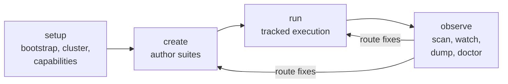

# harness

Workflow engine for tracked test work against Kubernetes and Kuma clusters. Harness manages disposable environments, suite authoring, tracked execution, live session inspection, and cross-agent coordination for Claude, Codex, Gemini, and Copilot.

For the internal module map, see [ARCHITECTURE.md](ARCHITECTURE.md).

## Install

```bash
mise run install
```

Builds a release binary and installs `harness` to `~/.local/bin`. Requires Rust 1.94+.

## Commands

### setup - environment and cluster preparation

```
harness setup bootstrap --agent <claude|codex|gemini|copilot>
harness setup agents generate [--check]
harness setup kuma <topology> <name> [flags]
harness setup gateway [--kubeconfig <path>] [--repo-root <path>]
harness setup capabilities
```

`bootstrap` wires a specific agent runtime into the project. `agents generate` renders shared assets from `agents/` into host-specific directories. `kuma` creates or attaches to a cluster. `gateway` installs Gateway API CRDs. `capabilities` reports what features and providers are available and ready on this machine right now.

### create - suite authoring

```
harness create begin
harness create save
harness create show [--kind <session|approval>]
harness create reset
harness create validate
harness create approval-begin
```

Guided workflow for writing new suites. `begin` starts the workspace, `approval-begin` starts the hook-enforced approval gate, `validate` checks content against the schema.

### run - tracked execution

```
harness run start --suite <path> --run-id <id> --profile <profile>
harness run init
harness run preflight
harness run capture
harness run record -- <command> [args...]
harness run apply --manifest <path>
harness run validate [--manifest <path>]
harness run restart-namespace [--namespace <ns>]
harness run task <name> [args...]
harness run status
harness run logs [--namespace <ns>]
harness run cluster-check
harness run envoy <subcommand>
harness run kuma <subcommand>
harness run diff [--manifest <path>]
harness run doctor
harness run repair
harness run runner-state
harness run resume [--run-id <id>]
harness run report
harness run closeout
harness run finish
```

`start` creates a new tracked run. `init` and `preflight` prepare the cluster. `apply`, `record`, `validate`, and `capture` are the core work loop. `doctor` and `repair` diagnose and fix broken run state. `finish` and `closeout` end the run and write the report.

### observe - live session inspection

```
harness observe [--agent <agent>] [--observe-id <id>] scan [session_id] [--action <action>]
harness observe [--agent <agent>] [--observe-id <id>] watch <session_id> [--poll-interval <s>] [--timeout <s>]
harness observe [--agent <agent>] [--observe-id <id>] dump <session_id> [--from-line <n>] [--to-line <n>] [--filter <text>]
harness observe [--agent <agent>] [--observe-id <id>] doctor [--json]
```

Four modes:

- `scan` classifies issues in a session log. Supports maintenance actions: `cycle`, `status`, `resume`, `verify`, `resolve-from`, `compare`, `list-categories`, `list-focus-presets`, `mute`, `unmute`.
- `watch` continuously polls for new events in a live session.
- `dump` prints raw events without classification. Supports line ranges, text and role filters, tool name filters, and raw JSON output.
- `doctor` validates observe wiring, session pointers, and compact handoff state.

### agents - cross-agent lifecycle

```
harness agents session-start --agent <agent> [--session-id <id>]
harness agents session-stop --agent <agent>
harness agents prompt-submit --agent <agent>
```

Runtime API for cross-agent coordination. Generated hooks call these commands to register sessions, record prompt events, and clean up state. The shared agent ledger lives under the harness project directory, not in host-native transcript storage.

### Hidden commands

`session-start`, `session-stop`, and `pre-compact` are top-level commands that hooks and lifecycle integrations call. You do not run them by hand.

## Workflow

The typical order:

1. `harness setup` - bootstrap agent wiring, create or attach to a cluster
2. `harness create` - author a suite (skip if you already have one)
3. `harness run` - execute the suite against a real cluster
4. `harness observe` - inspect live sessions, classify issues, route fixes



## Running a suite

### Local k3d cluster

```bash
REPO=/path/to/repo
SUITE=$REPO/suites/my-feature
RUN_ID=my-feature-001

harness setup kuma cluster single-up dev --repo-root "$REPO"
harness run start --suite "$SUITE" --run-id "$RUN_ID" --profile single-zone --repo-root "$REPO"
harness run apply --manifest manifests/app.yaml
harness run record -- kubectl get pods -A
harness run finish
```

For local k3d, prefer `--no-build` and `--no-load` flags over raw build/load env vars. Harness translates those internally.

### Remote cluster

```bash
harness setup kuma cluster \
  --provider remote \
  --remote name=dev,kubeconfig=/path/to/dev.yaml \
  --push-prefix ghcr.io/acme/kuma \
  --push-tag branch-dev \
  single-up dev
```

Harness materializes tracked kubeconfigs, pushes branch images, and deploys Kuma without creating or deleting the cluster itself.

### Resuming a run

```bash
harness run resume --run-id <id> --run-root <path>
```

Run state is persisted to disk. You can pick up unfinished runs later, and the command history stays attached to the run.

## Creating a suite

```bash
harness create begin \
  --repo-root "$REPO" \
  --feature my-feature \
  --mode interactive \
  --suite-dir "$SUITE_DIR" \
  --suite-name my-feature

harness create approval-begin --mode interactive --suite-dir "$SUITE_DIR"
harness create show --kind session
harness create validate
```

## Cross-agent sessions

Harness supports Claude, Codex, Gemini, and Copilot through a shared authoring and runtime model.

### Authoring

Skills and plugins are written once under `agents/` and rendered into host-specific directories:

- `.claude/` - Claude hooks, skills, settings
- `.agents/` - cross-agent assets
- `.gemini/` - Gemini wrapper
- `plugins/` - agent plugin definitions
- `.github/hooks/` - GitHub integration hooks

Treat those rendered directories as generated output. The source of truth is `agents/`.

```bash
harness setup agents generate        # render agents/ into host directories
harness setup agents generate --check  # verify they are in sync
harness setup bootstrap --agent claude  # wire one agent runtime
```

### Runtime

Generated hooks call back into `harness agents session-start`, `session-stop`, and `prompt-submit`. They do not keep their own durable state. The shared agent ledger under the harness project directory is the runtime source of truth.

### Observing across agents

```bash
harness observe --agent claude doctor
harness observe --agent codex scan <session-id>
```

## Hook guards

Harness intercepts agent tool use through hook guards that enforce tracked workflows.

`guard-bash` denies direct use of cluster binaries: `kubectl`, `kubectl-validate`, `docker`, `k3d`, `helm`, `kumactl`. It also blocks `gh` during active runs, inline Python, and legacy wrapper scripts. All cluster access must go through harness commands. The one exception is `harness run record -- kubectl ...` which routes through the tracked runner.

`guard-write` restricts file writes to the run surface area during active runs.

`guard-question` intercepts agent questions to keep them inside the tracked workflow.

## Runtime backends

Harness abstracts over multiple runtime backends and picks sensible defaults.

The container runtime defaults to Bollard (Docker API client). The Docker CLI binary is not required. Set `HARNESS_CONTAINER_RUNTIME=docker-cli` for the CLI fallback.

The Kubernetes runtime defaults to the native kube client. The `kubectl` binary is not required for `validate`, `apply`, `capture`, or readiness checks. Set `HARNESS_KUBERNETES_RUNTIME=kubectl-cli` for the CLI fallback. `kubectl` is still required for `harness run record -- kubectl ...` commands and any flow that explicitly selects the CLI backend.

```bash
harness setup capabilities    # see what is available and ready now
```

The output distinguishes between `available` (harness supports it), `readiness` (your machine is ready for it now), and `providers` (which cluster backends exist vs which are usable).

## Where harness stores things

Harness uses XDG-style state directories. The data root is `$XDG_DATA_HOME/harness/` (typically `~/.local/share/harness/`).

```
$XDG_DATA_HOME/harness/
  suites/                                        # suite library
  runs/<run-id>/                                 # tracked runs
    artifacts/                                   # collected output
    commands/                                    # recorded command logs
    manifests/                                   # prepared manifests
    suite-run-state.json                         # runner state
    run-report.md                                # human-readable report
  contexts/<session-hash>/                       # session context
```

Cross-agent state lives under the harness project directory:

```
$XDG_DATA_HOME/harness/projects/project-<digest>/agents/
  ledger/events.jsonl                            # normalized cross-agent events
  sessions/<agent>/<session-id>/raw.jsonl        # raw per-session payloads
  observe/<observe-id>/                          # shared observer state
```

The create approval state lives in harness-managed project state. Do not edit those files by hand.

## When you get stuck

- `harness observe doctor` - check wiring, lifecycle commands, run pointers, compact handoff, Kuma repo contract
- `harness setup agents generate --check` - verify generated agent assets are in sync with `agents/`
- `harness setup capabilities` - see which profiles and features are ready right now
- `harness observe scan` - classify problems in session logs
- `harness run doctor` - inspect one tracked run and its pointer state
- `harness run repair` - apply safe repairs to broken run metadata, status, or run pointers
- `run-report.md` in the run directory for the high-level result
- `commands/` in the run directory for the exact command history

If `harness run repair` still leaves blocking findings, start a fresh tracked run with `harness run start` instead of editing state files by hand.

## For contributors

```bash
mise run check    # type-check + clippy
mise run test     # unit + integration
```

See [ARCHITECTURE.md](ARCHITECTURE.md) for the internal module map.
