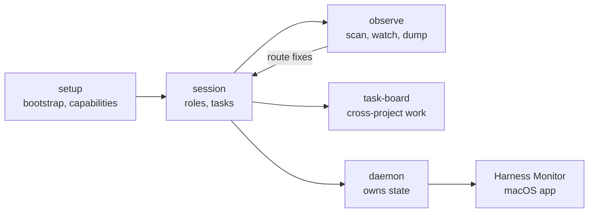

# harness

Harness is a local control plane for running multiple AI coding agents as a coordinated swarm. It works with Claude, Codex, Gemini, Copilot, Vibe, and OpenCode, and manages session state, roles, task assignment, review, and live inspection across them.

A background daemon holds that state and serves it to the CLI and to the macOS Harness Monitor app.

For the internal module map, see [ARCHITECTURE.md](ARCHITECTURE.md).

## Install

```bash
mise run install
```

Builds and installs the Harness CLI, the `harness-systemd` lifecycle controller, ACP adapters, and `aff` into `~/.local/bin`. Requires Rust 1.95+.

The installer reconciles stale Harness binaries on your `PATH`, including old `~/.cargo/bin/harness` shadows. If it cannot rewrite a conflicting path safely, it fails and tells you which path to clean up.

## Quick start

```bash
# 1. bootstrap agent wiring and runtime hook configs
mise run setup:bootstrap

# 2. open a session and bring agents into it with roles
harness session start --context "fix the retry backoff" --title "retry backoff"
harness session join <session-id> --role leader --runtime claude
harness session join <session-id> --role worker --runtime codex

# 3. watch the swarm work
harness session observe <session-id> --poll-interval 3 --json --actor <leader-agent-id>
```

## Concepts

- **Session** — a shared workspace where several agents work together with assigned roles.
- **Role** — leader, worker, observer, reviewer, or improver. Each carries a permission set that controls which commands the agent may run.
- **Task board** — cross-project work items, assigned to agents and tracked to completion.
- **Observe** — live inspection of agent sessions: scan logs, classify issues, watch events, dump raw output.
- **Daemon** — the local service that owns session and task state and serves the Harness Monitor app.

## Commands at a glance

| Command group | What it does |
| --- | --- |
| `harness setup` | Bootstrap agent wiring, report capabilities, inspect task-board secrets. |
| `harness session` | Orchestrate multiple agents with roles, tasks, and cross-agent observation. |
| `harness observe` | Inspect live sessions: `scan`, `watch`, `dump`, `doctor`. |
| `harness task-board` | Track cross-project work items and their assignment. |
| `harness daemon` | Run the local daemon that serves session and task state. |
| `harness bridge` | Supervise host capabilities for sandboxed Codex and terminal agent flows. |
| `harness-hook` | Cross-agent lifecycle entrypoints, called by generated hooks. |

Run any command with `--help` for the full flag reference.

## Typical workflow


```mermaid
flowchart LR
    Setup["setup\nbootstrap, capabilities"] --> Session["session\nroles, tasks"]
    Session --> Observe["observe\nscan, watch, dump"]
    Observe -->|"route fixes"| Session
    Session --> Board["task-board\ncross-project work"]
    Session --> Daemon["daemon\nowns state"]
    Daemon --> Monitor["Harness Monitor\nmacOS app"]
```

1. `harness setup` — bootstrap agent wiring and check what this machine supports.
2. `harness session` — open a session and give each agent a role.
3. `harness observe` — inspect sessions, classify issues, route fixes.
4. `harness task-board` — track the work items the swarm is assigned.

## Multi-agent sessions

Agents join a session with a role — leader, worker, observer, reviewer, or improver. Each role has a permission set that controls which commands it can run. One observer scans every agent's log through the same classifier pipeline as `harness observe`.

```bash
harness session start --context "fix the retry backoff" --title "retry backoff"
harness session join <session-id> --role leader  --runtime claude
harness session join <session-id> --role worker  --runtime codex
harness session join <session-id> --role observer --runtime gemini
harness session observe <session-id> --poll-interval 3 --json --actor <leader-agent-id>
harness session task list <session-id> --json
harness session end <session-id> --actor <leader-agent-id>
```

To narrow bootstrap to a subset of runtimes, or to inspect one agent in particular:

```bash
mise run setup:bootstrap -- --agents codex
harness observe --agent codex scan <session-id>
```

## The daemon and Harness Monitor

The daemon owns session, agent, and task-board state and serves it over a local HTTP API described by [docs/api/openapi.json](docs/api/openapi.json). The macOS Harness Monitor app is a client of that API and gives the swarm a live window: sessions, agents, tasks, and reviews as they change.

```bash
harness daemon --help    # lifecycle and control routes
```

For production installation, upgrades, and rollback of the daemon, see [docs/remote-systemd-upgrades.md](docs/remote-systemd-upgrades.md).

## Hook guards

Harness intercepts agent tool use through hooks generated by `setup:bootstrap`.

- **`tool-guard`** inspects a tool call before it runs and can deny it.
- **`tool-result`** validates tool outcomes after each tool completes.

Every generated registration claims the `suite:run` skill, and the guard body returns early unless the session confirms that skill. That confirmation required state the retired suite-run workflow created, so the bash guards currently allow every command in an ordinary session. Treat `tool-guard` as wiring that is in place rather than as an enforcement boundary you can rely on today.

## Capabilities

```bash
harness setup capabilities   # what is supported and ready on this machine right now
```

The output separates `available` (harness supports it) from `readiness` (your machine is ready now).

## Where harness stores things

Harness uses XDG-style state directories. The data root is `$XDG_DATA_HOME/harness/` (typically `~/.local/share/harness/`).

```
$XDG_DATA_HOME/harness/
  sessions/                  # session workspaces
  contexts/<session-hash>/   # session context
  projects/project-<digest>/ # cross-agent state: agent ledger, signals, orchestration
```

Use the harness commands to change this state rather than editing the files by hand.

## When you get stuck

- `harness observe doctor` — check wiring, lifecycle commands, and compact handoff.
- `harness setup capabilities` — see which features are ready right now.
- `harness observe scan` — classify problems in a session log.
- `harness observe dump` — read the raw agent output behind a classification.

## For contributors

```bash
mise run check            # default quality gate
mise run test             # default test aggregate (harness + aff fast tests)
mise run test:unit        # harness unit tests
mise run test:integration # harness integration tests
mise run openapi:check    # daemon OpenAPI schema drift gate (docs/api/openapi.json)
mise run monitor:test     # generate + lint + test the macOS Harness Monitor app
```

Focused macOS test:

```bash
XCODE_ONLY_TESTING=HarnessMonitorKitTests/PolicyGapRuleTests mise run monitor:test
```

The macOS Harness Monitor app lives under `apps/harness-monitor/`. Its Xcode project is generated from the Tuist manifests, so run `mise run monitor:generate` before opening it in Xcode.

Further reading:

- [ARCHITECTURE.md](ARCHITECTURE.md) — internal module map.
- [docs/agent-guides/](docs/agent-guides/) — delivery workflows, root reference, monitor reference.
- [docs/remote-systemd-upgrades.md](docs/remote-systemd-upgrades.md) — production daemon installation, upgrades, and rollback.
- [AGENTS.md](AGENTS.md) — the contract for agents working in this repo.
