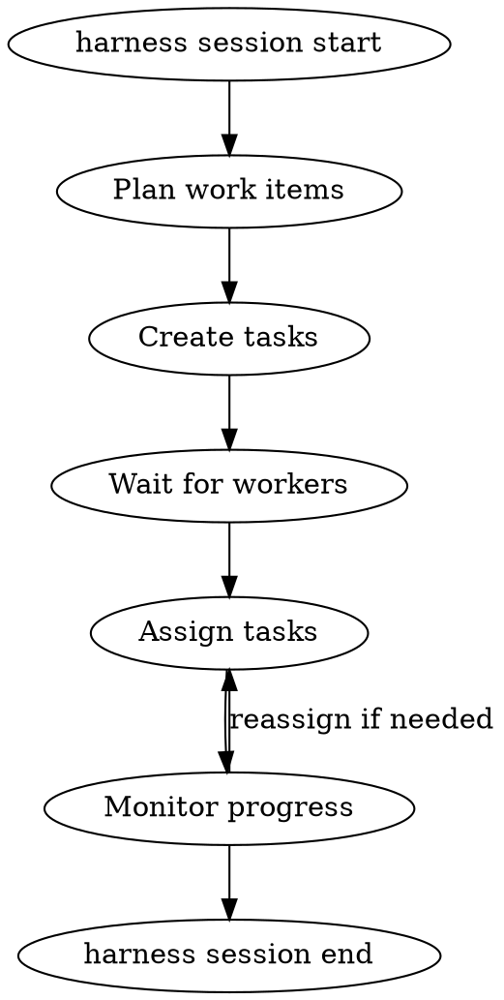
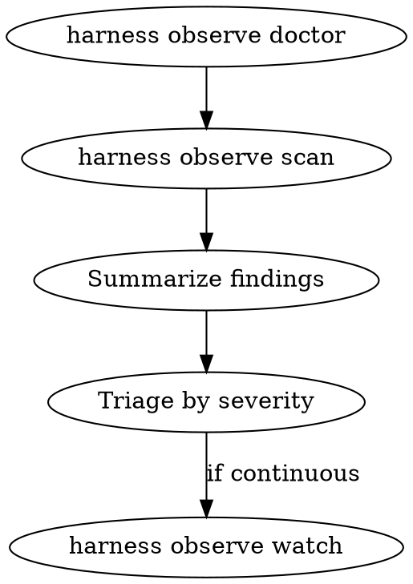

<!-- justify: CF-tools-usage Workers execute tasks requiring Edit/Write/Glob/Grep; AskUserQuestion for session picker and confirmations -->
<!-- justify: CF-side-effect Side effects are intentional - workers edit files as part of task execution -->
<!-- justify: FC-doc-hint Hint shows two-level dispatch pattern; specific flags vary by subcommand and are covered in examples -->
<!-- justify: AQ-option-structure AskUserQuestion used for session picker which presents numbered list dynamically -->

# Harness

Multi-agent session orchestration and observation. First argument selects the command family.

## Dispatch

Parse `$ARGUMENTS`:
- First positional: `session` or `observe`
- Remaining args: passed to subcommand

| Command | Purpose |
|---------|---------|
| `session` | Multi-agent orchestration |
| `observe` | Session observation pipeline |

Read [references/session-commands.md](references/session-commands.md) for `harness session` subcommands.
Read [references/observe-commands.md](references/observe-commands.md) for `harness observe` subcommands.

## Contract

All state flows through `harness` commands. Do not read or write orchestration files directly.

---

## session start

You become the leader. You are a coordinator, not an executor.

### Hard constraints

- Do not execute tasks yourself
- Do not edit files or write code
- Wait for workers to join before assigning tasks
- Ask user before spawning subagents

If you catch yourself about to edit a file or run code to implement something: stop. Create a task for it instead.

### Arguments

| Argument | Default | Purpose |
|----------|---------|---------|
| `--context` | required | Human-readable goal for the session |
| `--session-id` | auto-generated | Explicit session ID |
| `--title` | none | Short human-readable session name |
| `--runtime` | auto-detect | Agent runtime |

### Workflow



1. Start the session: `harness session start --context "<goal>"` (or `--session-id <id>` for explicit ID)
2. Note session ID and agent ID from output

Read [references/signals.md](references/signals.md) for signal protocol when redirecting agents.
3. Break goal into discrete tasks
4. Create tasks: `harness session task create <session-id> --title "..." --context "..." --actor <agent-id>`
5. Tell user to spawn workers: `/harness:harness session join <session-id> --role worker`
6. Poll status until workers join: `harness session status <session-id> --json`
7. Assign tasks: `harness session task assign <session-id> <task-id> <agent-id> --actor <agent-id>`
8. Monitor: `harness session task list <session-id> --json`
9. End when done: `harness session end <session-id> --actor <agent-id>`

Read [references/session-commands.md](references/session-commands.md) for exact command syntax.

---

## session join

Join with a role. Behavior depends on role.

### Arguments

| Argument | Default | Purpose |
|----------|---------|---------|
| positional | interactive | Session ID to join |
| `--role` | `worker` | Role: worker, observer, reviewer, improver |
| `--runtime` | auto-detect | Which runtime you are |
| `--capabilities` | none | Comma-separated capability tags |

### Session picker

When no session ID provided:

```bash
harness session list --json
```

If exactly one active session, confirm before joining. If multiple, present numbered list.

### Roles

| Role | Can do |
|------|--------|
| worker | Execute tasks, update own status |
| observer | Monitor, create tasks from findings |
| reviewer | Review done tasks, reassign |
| improver | Review and make improvements |

Read [references/roles-and-permissions.md](references/roles-and-permissions.md) for full permission matrix.

### Worker workflow

1. Join: `harness session join <session-id> --role worker --runtime <runtime>`
2. Check assigned tasks: `harness session task list <session-id> --json`
3. Claim task: `harness session task update <session-id> <task-id> --status in-progress --actor <agent-id>`
4. Do the work following project conventions
5. Report progress: `harness session task checkpoint <session-id> --summary "..." --progress 50 --actor <agent-id>`
6. Complete: `harness session task update <session-id> <task-id> --status done --note "..." --actor <agent-id>`
7. Check for more work or signals

### Observer workflow

As observer you do not execute tasks. Monitor and triage only.

1. Join: `harness session join <session-id> --role observer --runtime <runtime>`
2. Run baseline scan: `harness observe --agent <agent> scan <session-id> --json --summary`
3. Triage findings by severity and category
4. Create tasks from issues: `harness session task create <session-id> --title "..." --context "..." --actor <agent-id>`
5. For continuous monitoring: `harness observe watch <session-id> --poll-interval 3 --timeout 90 --json`

Read [references/issue-taxonomy.md](references/issue-taxonomy.md) for category ownership and fix routing.

### Reviewer / Improver workflow

1. Check tasks needing review: `harness session task list <session-id> --json`
2. Look for status `done` or `in-review`
3. Review changed files, run checks, verify acceptance criteria
4. If needs fixes: reassign and set status to `open`
5. If approved: `harness session task update <session-id> <task-id> --status done --note "reviewed" --actor <agent-id>`

---

## observe

Observe a session through the classifier pipeline.

### Contract

All state flows through `harness observe`. Do not read state paths directly:
- `~harness/projects/project-<digest>/agents/observe/<observe-id>/`

### Arguments

| Argument | Default | Purpose |
|----------|---------|---------|
| positional | required | Session ID to observe |
| `--agent` | none | Narrow to runtime (claude/codex/gemini/copilot) |
| `--observe-id` | `project-default` | Shared observer state identity |
| `--from-line` | 0 | Start at specific JSONL line |
| `--from` | none | Resolve start from line/timestamp/prose |
| `--focus` | `all` | Category filter preset (harness/skills/all) |

Resolution rules for `--from`:
- Numeric: use directly as line number
- ISO timestamp: first event at or after that time
- Prose: earliest matching substring

### Workflow



1. Verify wiring: `harness observe --agent <agent> doctor --json`
2. Run baseline scan: `harness observe --agent <agent> scan <session-id> --json --summary`
3. Summarize: counts by severity/category, critical first, likely fix target
4. For continuous monitoring: `harness observe watch <session-id> --poll-interval 3 --timeout 90 --json`

Do not auto-fix. Triage first.

Read [references/observe-commands.md](references/observe-commands.md) for full command surface.
Read [references/issue-taxonomy.md](references/issue-taxonomy.md) for category ownership and fix routing.
Read [references/observe-overrides.md](references/observe-overrides.md) for mute/focus configuration.

### Maintenance actions

Manage observer state through `scan --action`:

| Action | Purpose |
|--------|---------|
| `cycle` | Advance stored cursor, persist new findings |
| `status` | Inspect current observer state |
| `resume` | Continue from stored cursor |
| `verify` | Check if fingerprint still reproduces |
| `resolve-from` | Resolve line from prose/timestamp |
| `compare` | Compare two windows |
| `mute` / `unmute` | Manage muted issue codes |

### When to use dump

Use `harness observe dump` when:
- A classifier finding looks suspicious
- The issue is `unexpected_behavior`
- You need exact raw context around a line range

### Spawning deep analyst

For subtle issues the classifier may miss, spawn `deep-analyst` agent:
- Provide session-id, project-hint, line range
- Agent returns plain markdown with line-level findings

Read [agents/deep-analyst.md](agents/deep-analyst.md) for agent descriptor.

---

## Rules

- Pass `--actor <agent-id>` for mutating operations
- Use `--json` for machine-readable output when parsing results
- Leader cannot end session with in-progress tasks
- Workers: update status to `in-progress` before starting, `blocked` if stuck, `done` when finished
- Workers: do not modify files another agent is actively working on
- Observers: do not edit files or execute tasks
- Add `--project-hint` only if KSRCLI085 error (ambiguous session)
- Do not read orchestration state files directly, use harness commands

---

## Examples

<example>
Start a new session as leader:
```
/harness:harness session start --context "Implement user authentication feature"
```
</example>

<example>
Start with explicit session ID and title:
```
/harness:harness session start --context "Fix login bug" --session-id auth-fix-001 --title "Auth bugfix"
```
</example>

<example>
Join an existing session as worker:
```
/harness:harness session join abc123 --role worker --runtime claude
```
</example>

<example>
Observe a session for issues:
```
/harness:harness observe scan abc123 --json --summary
```
</example>

<example>
List tasks in a session:
```
/harness:harness session task list abc123 --status open --json
```
</example>
